# Rapport projet MIDL 2

Par Julien LEFEBVRE et Lily AIMONIER-DAVAT et Corentin VAILLANT

## Table des matières

- [Rapport projet MIDL 2](#rapport-projet-midl-2)
  - [Table des matières](#table-des-matières)
  - [Introduction](#introduction)
  - [Utilisation de MMPOSE](#utilisation-de-mmpose)
  - [Prédictions](#prédictions)
    - [Premier modèle](#premier-modèle)
      - [lstm\_simple :](#lstm_simple-)
    - [Deuxième modèle](#deuxième-modèle)
      - [conv\_lstm](#conv_lstm)
    - [Troisième modèle](#troisième-modèle)
      - [model\_pos\_vel](#model_pos_vel)
  - [Annexes](#annexes)
    - [Graphes](#graphes)
      - [Analyse des points récupérés](#analyse-des-points-récupérés)
      - [Erreur moyenne sur la longueur des os lstm\_simple](#erreur-moyenne-sur-la-longueur-des-os-lstm_simple)
      - [Erreur en auto-régression lstm\_simple](#erreur-en-auto-régression-lstm_simple)
      - [Erreur sur les jointures dans le temps conv\_lstm](#erreur-sur-les-jointures-dans-le-temps-conv_lstm)
      - [Erreur auto-régression model\_pos\_vel](#erreur-auto-régression-model_pos_vel)
    - [Liens](#liens)
    - [Sources](#sources)

## Introduction

Dans ce projet, nous nous sommes intéressés à l’analyse et à la prédiction de trajectoires du
mouvement humain à partir de vidéos.  
Ce type de problématique est central en vision par ordinateur, notamment pour des applications
comme l’analyse du geste, le sport, la biomécanique ou encore la danse.  
Nous avons choisi de nous concentrer sur le mouvement humain dans un contexte artistique,
plus précisément la danse, car elle offre des trajectoire continues, structurées et riches à
analyser.  
Parmi les différents types de mouvements possibles, nous avons volontairement choisi des
danses de style classique ou contemporain fluide.  
L’objectif était d’éviter les mouvements trop explosifs ou acrobatiques, comme le breakdance,
qui peuvent poser problème pour l’estimation de pose et rendre l’analyse des trajectoires moins
stable.  
La danse classique présente au contraire des mouvements lents, contrôlés, avec des
trajectoires continues des bras, des jambes et du centre du corps, ce qui est particulièrement
adapté à l’analyse temporelle.  
Pour travailler sur des données cohérentes et exploitables, nous avons utilisé un jeu de
données existant appelé AIST++, qui est un dataset de recherche dédié à la danse.
Ce dataset contient des vidéos de danse filmées avec une caméra fixe, en plan large, ce qui
permet de voir l’ensemble du corps du danseur, un point essentiel pour l’estimation de pose
avec MMPose.  
Même si AIST++ ne contient pas de ballet classique académique au sens strict, il propose
certains styles de danse fluide, proches du classique et du néo-classique, qui restent
compatibles avec notre objectif d’analyse de trajectoires continues.  
Le jeu de données a été récupéré depuis le site officiel du projet AIST++.  
Après avoir accepté les conditions d’utilisation, nous avons utilisé le script de téléchargement
fourni par les auteurs du dataset, ce qui permet de récupérer automatiquement les vidéos.  
Nous avons ensuite sélectionné manuellement un sous-ensemble de vidéos correspondant à
des styles de danse fluide et contrôlée, et exclu les styles plus explosifs comme le hip-hop ou le
breakdance.  
Ce choix de jeu de données nous permet donc de travailler sur des mouvements réalistes,
lisibles et cohérents avec les hypothèses de MMPose, tout en restant dans un cadre artistique
et contrôlé, adapté à l’analyse et à la prédiction de trajectoires.

## Utilisation de MMPOSE

Pour la prédiction des points, nous avons choisi de faire tourner MMPose en local en utilisant
Cuda pour permettre notamment d’utiliser les modèles en 3D. Pour l'installation de MMPose
nous avons utilisé Conda comme indiqué dans le tutoriel officiel de MMPose pour simplifier
l’installation.
Nous avons utilisé le modèle `human3d` (l’alias du modèle
vid_pl_motionbert_8xb32-120e_h36m) qui permet une extraction de 17 points clés en 3D
sur un corps humain complet. Ces 17 `keypoints` suivent le standard `Human3.6M`.
Ainsi, nous avons pu récupérer nos points sur l’ensemble de notre `dataset` et grâce au choix
de celui-ci, MMPose a donné des résultats très satisfaisants. En effet, tous nos scores de
prédiction est à 1 sur l’ensemble du `dataset`.
En analysant les résultats fournis par MMPose, nous nous sommes rendu compte que le
point zéro qui correspond au bassin sert d’origine pour les axes x et y de nos key points. De
plus, nous avons remarqué que certains `keypoints` notamment ceux qui sont sur une même
partie du corps, comme le bras avec le poignet, le coude et l'épaule ou la jambe avec le
pied, le genou et la hanche, ont des mouvements corrélés. Aussi, nous avons remarqué que
certains `keypoints` étaient plus mobiles que d’autres, par exemple la position des
mains varient beaucoup plus que la position du bassin notamment. On peut faire aussi la
même remarque pour la vitesse et l'accélération qui sont plus importantes aux extrémités du
corps (comme les mains ou les pieds) que pour les autres parties (comme le bassin par
exemple). Enfin, nous avons aussi remarqué que les hauteurs de nos points ne subissent
pas de grandes variations, les parties hautes du corps restent en haut et les parties basses
restent en bas.

Pour plus de détails, vous pouvez consulter le notebook analyse.ipynb, et aussi regarder les graphes mis à disposition ici : [Analyse des points récupérés](#analyse-des-points-récupérés)

## Prédictions

### Premier modèle

Nous avons d'abord commencé par suivre l'une des indications donner sur la présentation de l'UE projet MIDL 2.  
Nous sommes partis sur un modèle avec deux couches LSTM (long-short-term-memory), de manière naïve, sans vraiment réfléchir à la meilleure forme possible.  
Nous en sommes venus à ce modèle :

#### lstm_simple : 
<pre style="white-space:pre;overflow-x:auto;line-height:normal;font-family:Menlo,'DejaVu Sans Mono',consolas,'Courier New',monospace">┏━━━━━━━━━━━━━━━━━━━━━━━━━━━━━━━━━┳━━━━━━━━━━━━━━━━━━━━━━━━┳━━━━━━━━━━━━━━━┓
┃ Layer (type)                    ┃ Output Shape           ┃       Param # ┃
┡━━━━━━━━━━━━━━━━━━━━━━━━━━━━━━━━━╇━━━━━━━━━━━━━━━━━━━━━━━━╇━━━━━━━━━━━━━━━┩
│ lstm (LSTM)                     │ (None, 30, 128)        │        92,160 │
├─────────────────────────────────┼────────────────────────┼───────────────┤
│ lstm_1 (LSTM)                   │ (None, 128)            │       131,584 │
├─────────────────────────────────┼────────────────────────┼───────────────┤
│ dense (Dense)                   │ (None, 51)             │         6,579 │
└─────────────────────────────────┴────────────────────────┴───────────────┘
</pre>

Ce modèle est pensé avant tout pour prédire 1 `frame` à avenir, et prend en entrés les 30 `frame` précédentes (on appelle cette constante `WINDOW_SIZE`).
Nous sommes étonnés de voir à quels points ce dernier arrive à "comprendre" la notion de longueur des os (voir [Erreur sur la longueur d'os lstm_simple](#erreur-moyenne-sur-la-longueur-des-os-lstm_simple)).
Globalement ce modèle performe relativement bien pour prédire une `frame` à l'avenir, mais dès qu'il faut prédire plusieurs `frame` en auto-régression, ce dernier a de très mauvais résultats par rapport aux autres modèles (voir [Erreur en auto-régression lstm_simple](#erreur-en-auto-régression-lstm_simple)), en effet, l'erreur s'accumule, et explose sur les premières `frame`, puis se stabilise, suivant une progression logarithmique.  
Pour rester concis, nous parlerons plus en détaille sur l'implémentation et sur la notion de LSTM lors de la présentation orale.

### Deuxième modèle

Pour le deuxième modèle, nous avons expérimenté sur plusieurs points :

- premièrement, nous passons, et récupérons, la vitesse au lieu de la position des points, la vitesse étant calculée par la différence de position en chaque `frames`
- ensuite, en nous inspirant des résultats du projet de l'UE IA, nous avons décidé de faire un modèle avec des `layer` de convolution
- et enfin, au lieu de prédire 1 `frame` à avenir, ce modèle prédit 10 `frame` (on appelle cette constante `HORIZON`)

#### conv_lstm
<pre style="white-space:pre;overflow-x:auto;line-height:normal;font-family:Menlo,'DejaVu Sans Mono',consolas,'Courier New',monospace">┏━━━━━━━━━━━━━━━━━━━━━━━━━━━━━━━━━┳━━━━━━━━━━━━━━━━━━━━━━━━┳━━━━━━━━━━━━━━━┓
┃ Layer (type)                    ┃ Output Shape           ┃       Param # ┃
┡━━━━━━━━━━━━━━━━━━━━━━━━━━━━━━━━━╇━━━━━━━━━━━━━━━━━━━━━━━━╇━━━━━━━━━━━━━━━┩
│ conv1d (Conv1D)                 │ (None, 30, 128)        │        32,768 │
├─────────────────────────────────┼────────────────────────┼───────────────┤
│ batch_normalization             │ (None, 30, 128)        │           512 │
│ (BatchNormalization)            │                        │               │
├─────────────────────────────────┼────────────────────────┼───────────────┤
│ conv1d_1 (Conv1D)               │ (None, 30, 128)        │        49,280 │
├─────────────────────────────────┼────────────────────────┼───────────────┤
│ batch_normalization_1           │ (None, 30, 128)        │           512 │
│ (BatchNormalization)            │                        │               │
├─────────────────────────────────┼────────────────────────┼───────────────┤
│ lstm_2 (LSTM)                   │ (None, 128)            │       131,584 │
├─────────────────────────────────┼────────────────────────┼───────────────┤
│ dropout (Dropout)               │ (None, 128)            │             0 │
├─────────────────────────────────┼────────────────────────┼───────────────┤
│ dense_1 (Dense)                 │ (None, 510)            │        65,790 │
├─────────────────────────────────┼────────────────────────┼───────────────┤
│ reshape (Reshape)               │ (None, 10, 51)         │             0 │
└─────────────────────────────────┴────────────────────────┴───────────────┘
</pre>

Ce modèle a tendance à être pire que le précédent lorsqu'il s'agit de prédire la prochaine `frame`, avec une erreur linéaire en fonction du temps, probablement dû au caractère "additive" de la vitesse en fonction du temps (voir [Erreur sur les jointures dans le temps conv_lstm](#erreur-sur-les-jointures-dans-le-temps-conv_lstm)).
Mais est plus stable que le précédent en auto-régression, ce qui est bon signe pour la suite.
Nous parlerons évidement plus en détaille de l'implémentation, du calcul de la vitesse et de la position, ainsi que de ce qu'est le `layer` de convolution durant la présentation oral.

### Troisième modèle

Et enfin le modèle final, après quelques expérimentations, nous en sommes venues à ce modèle "synthèse" :

#### model_pos_vel
<pre style="white-space:pre;overflow-x:auto;line-height:normal;font-family:Menlo,'DejaVu Sans Mono',consolas,'Courier New',monospace">┏━━━━━━━━━━━━━━━━━━━━━━━━━━━━━━━━━┳━━━━━━━━━━━━━━━━━━━━━━━━┳━━━━━━━━━━━━━━━┓
┃ Layer (type)                    ┃ Output Shape           ┃       Param # ┃
┡━━━━━━━━━━━━━━━━━━━━━━━━━━━━━━━━━╇━━━━━━━━━━━━━━━━━━━━━━━━╇━━━━━━━━━━━━━━━┩
│ conv1d_2 (Conv1D)               │ (None, 26, 128)        │        65,408 │
├─────────────────────────────────┼────────────────────────┼───────────────┤
│ batch_normalization_2           │ (None, 26, 128)        │           512 │
│ (BatchNormalization)            │                        │               │
├─────────────────────────────────┼────────────────────────┼───────────────┤
│ conv1d_3 (Conv1D)               │ (None, 24, 128)        │        49,280 │
├─────────────────────────────────┼────────────────────────┼───────────────┤
│ batch_normalization_3           │ (None, 24, 128)        │           512 │
│ (BatchNormalization)            │                        │               │
├─────────────────────────────────┼────────────────────────┼───────────────┤
│ lstm_3 (LSTM)                   │ (None, 256)            │       394,240 │
├─────────────────────────────────┼────────────────────────┼───────────────┤
│ repeat_vector (RepeatVector)    │ (None, 10, 256)        │             0 │
├─────────────────────────────────┼────────────────────────┼───────────────┤
│ lstm_4 (LSTM)                   │ (None, 10, 256)        │       525,312 │
├─────────────────────────────────┼────────────────────────┼───────────────┤
│ dense_2 (Dense)                 │ (None, 10, 51)         │        13,107 │
└─────────────────────────────────┴────────────────────────┴───────────────┘
</pre>

Ce modèle prend en entrer la position ainsi que la vitesse et nous ressort une position, afin d'éviter les plus fortes accumulations d'erreur lors en fonction du temps.

Il intègre aussi le `layer` `RepeatVector` de `Tensorflow` qui nous permet de répéter un input, autant de fois que désirer, dans le but de sortir `HORIZON`  `frame` de manière plus efficace.

Ce modèle s'est aussi vu doté d'un entrainement améliorer, nous avons changé la `loss`, pour qu'elle prenne en comptes la longueur des os, ainsi que la vitesse pour éviter les changements de positions trop brusques.
Et de plus, nous avons écrit un script qui insère aléatoirement des `frames` générer par le modèle dans son jeu d'entrainement, afin d'améliorer l'auto-régression.

Finalement ce dernier modèle performe bien, on voit une nette amélioration par rapport au deux premiers modèles, mais il faut noter que ce dernier est beaucoup plus couteux à entrainer, et notamment, vraiment demandant en mémoire vive, dû à sa taille, et aux données d'entrer qui sont doublées.

Malgré la `loss`, qui prend en compte la longueur des os, le modèle a une erreur plus forte sur ce critère, mais plus stable dans le temps.  
Peut-être, faut-il augmenter le poids de la `loss` associée, ou changer l'implémentation (voir [Erreur auto-régression model_pos_vel](#erreur-auto-régression-model_pos_vel)).

Encore une fois, plus de détail sur le `layer` `RepeatVector`, ainsi que sur le formatage des données et l'entrainement seront donnés lors de l'oral, afin de rester concis.

## Annexes

### Graphes

#### Analyse des points récupérés

  
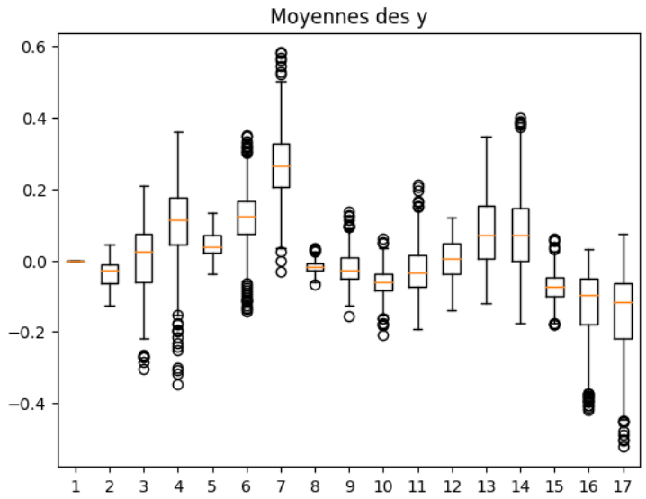  
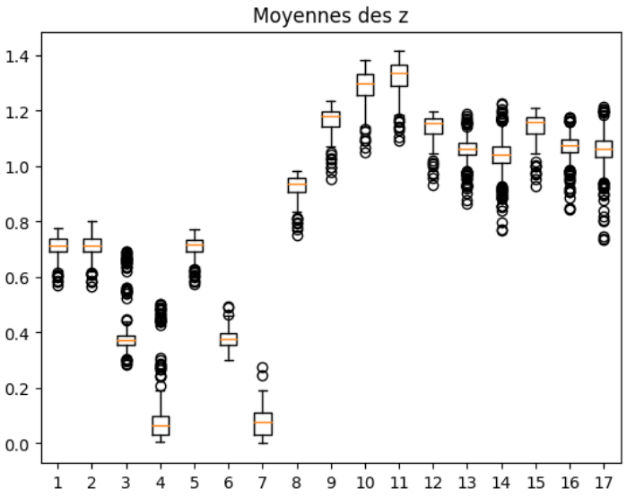  

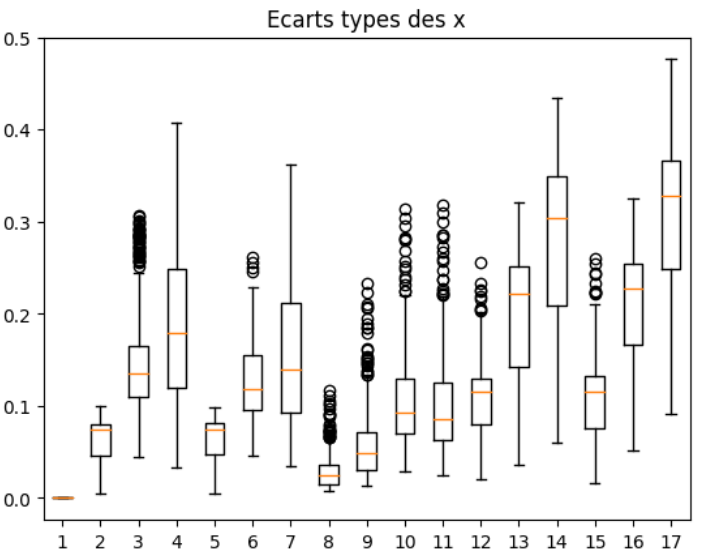  
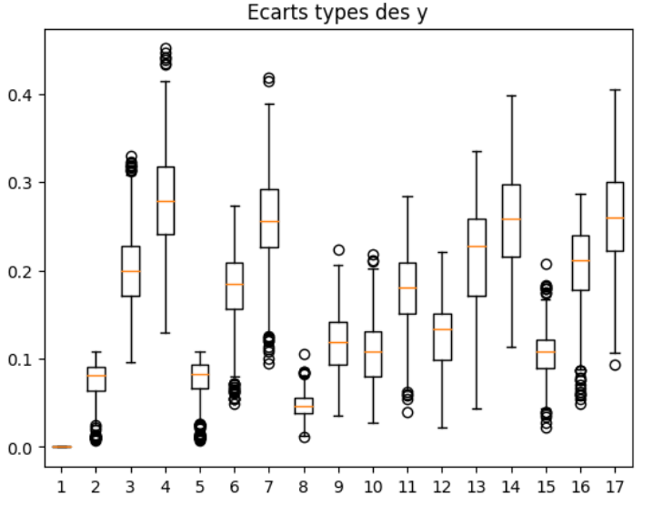  
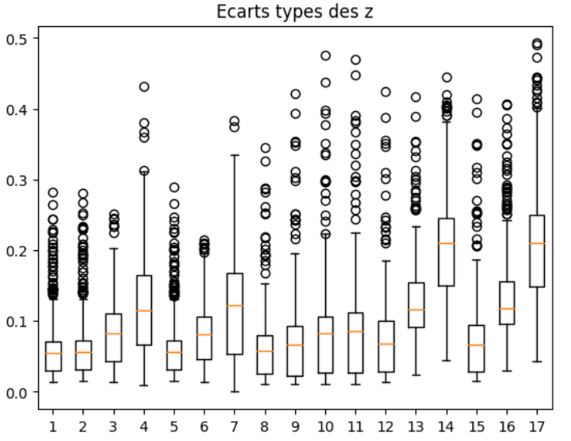  

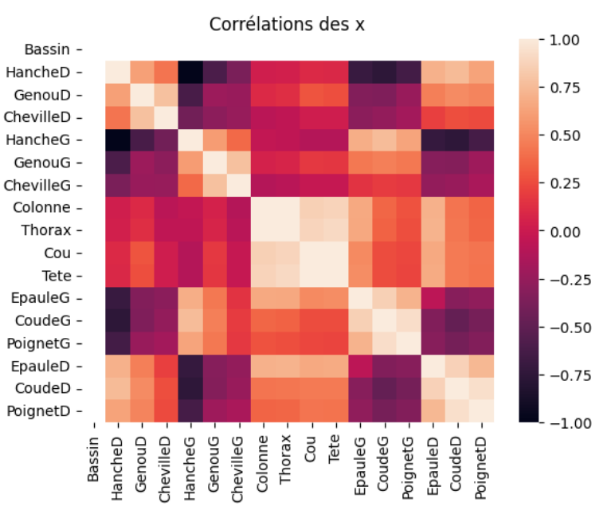  

#### Erreur moyenne sur la longueur des os lstm_simple

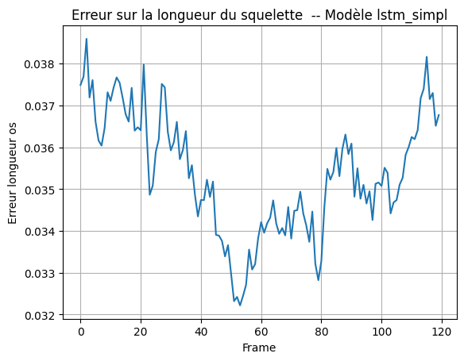

#### Erreur en auto-régression lstm_simple

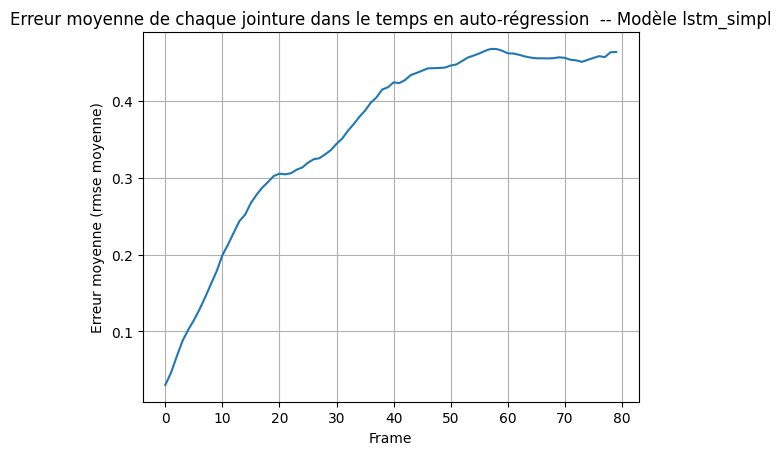  

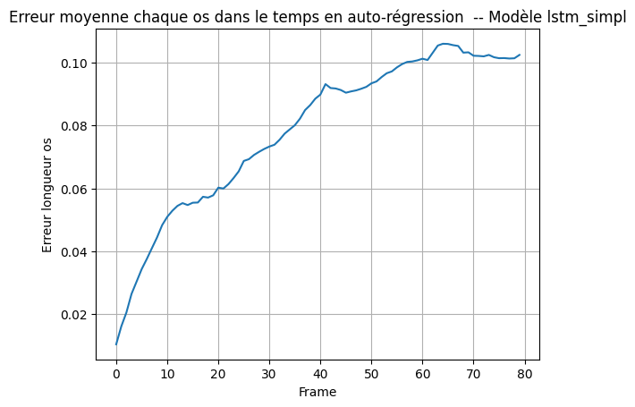  

#### Erreur sur les jointures dans le temps conv_lstm

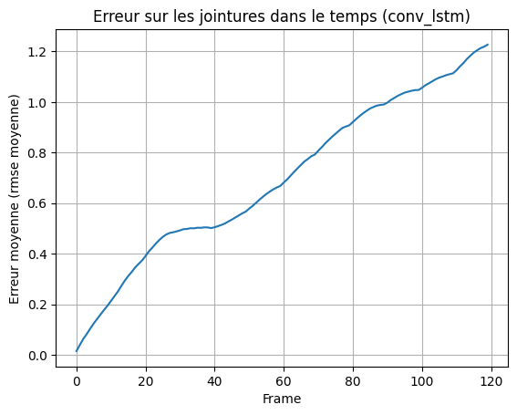  

.png)

#### Erreur auto-régression model_pos_vel

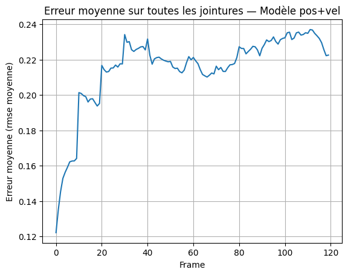

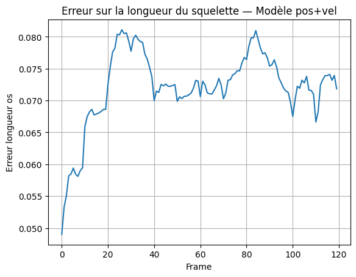  

### Liens

- [Lien Github vers le projet](https://github.com/JulienLEFEBV/ProjetMIDL2)

### Sources

- [Lien vers le site d'AIST++](google.github.io/aistplusplus_dataset/factsfigures.html)
- [Lien vers le repo github de MMPOSE](https://github.com/open-mmlab/mmpose)
- [Page wikipedia sur les LSTM](https://en.wikipedia.org/wiki/Long_short-term_memory)
- [Documentation tensorflow sur les LSTM](https://www.tensorflow.org/api_docs/python/tf/keras/layers/LSTM)
- [Page wikipedia sur les réseaux de neuronnes convolutifs](https://fr.wikipedia.org/wiki/R%C3%A9seau_neuronal_convolutif)
- [Documentation tensorflow sur le `layer` Conv1D](https://www.tensorflow.org/api_docs/python/tf/keras/layers/Conv1D)
- [Documentation tensorflow]([tensorflow.org](https://www.tensorflow.org/))
